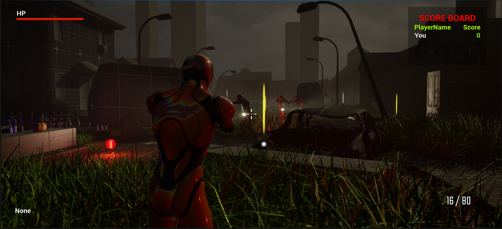
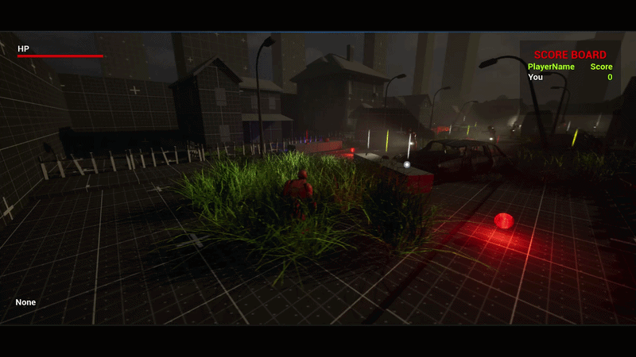
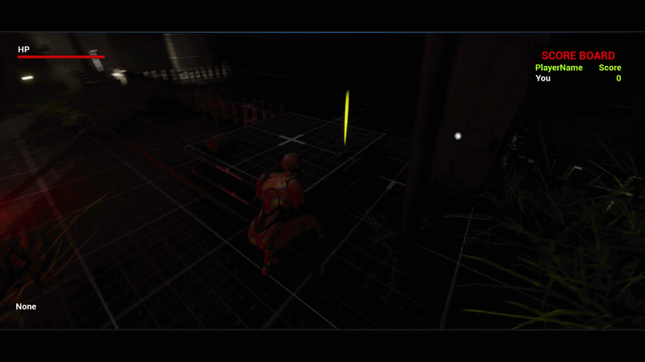
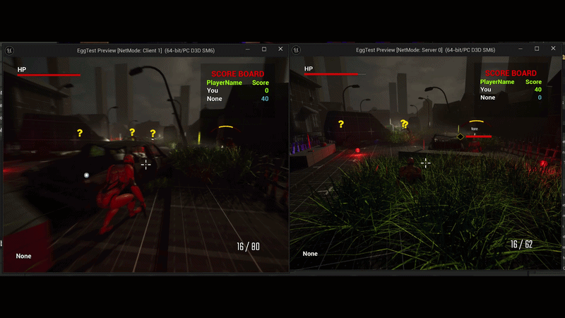

# Multiplayer Stealth Prototype

  

A multiplayer stealth-action prototype built in <b>Unreal Engine 5</b> using <b>C++</b> and <b>Blueprints</b>.

---

## Gameplay

| Stealth               | Combat               |
| --------------------- | -------------------- |
|  |  |

| AI Luring            | Multiplayer               |
| -------------------- | ------------------------- |
|  |  |

---

## Features

* Multiplayer replication
* AI Perception & Behavior Trees
* Tall grass stealth system
* Enemy luring with throwable rocks
* Gun combat
* Grenade explosions with area damage
* Enemy investigation and search behaviors
* Interaction system
* Enemy awareness indicators
* Modular gameplay framework

---

## Built With

* Unreal Engine 5
* C++
* Blueprints
* Enhanced Input
* AI Perception
* Behavior Trees
* Unreal Networking

---

## Screenshots

---

## Project Goal

This project focuses on developing scalable gameplay systems for multiplayer stealth games while emphasizing clean architecture, networking, AI, and reusable gameplay mechanics.

Gameplay demo

